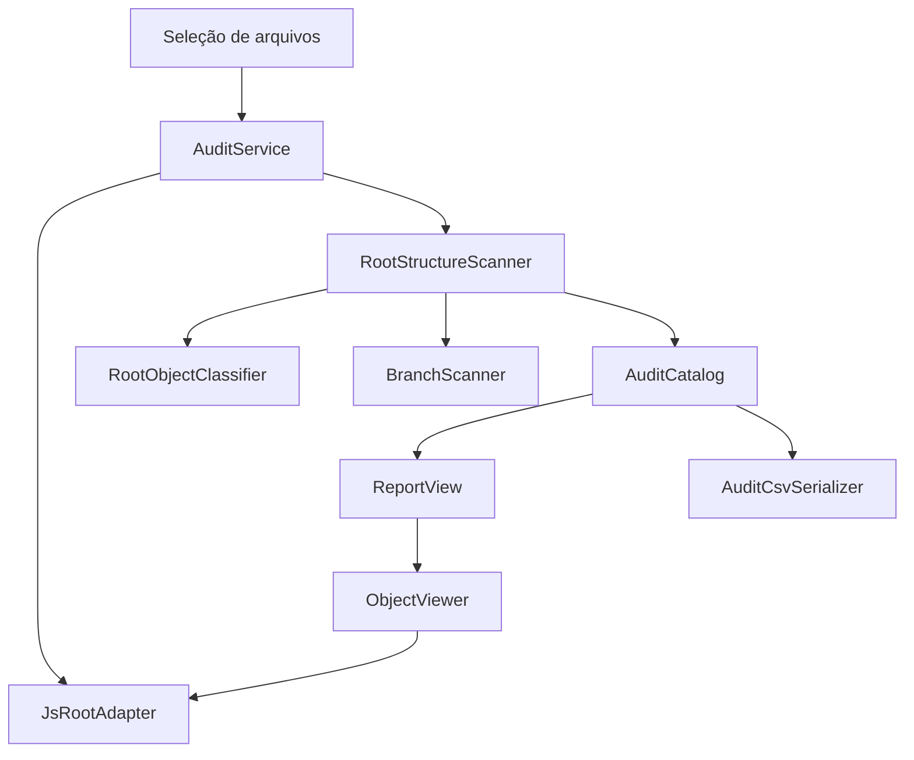

# Arquitetura

## Princípio da Responsabilidade Única

Cada componente tem um único motivo principal para mudar:

| Componente | Responsabilidade |
| --- | --- |
| `RootObjectClassifier` | Converter um nome de classe ROOT em categoria e opção de desenho |
| `RootPath` | Construir caminhos ROOT e ciclos sem concatená-los pela aplicação |
| `BranchScanner` | Transformar a hierarquia de branches em entradas de auditoria |
| `RootStructureScanner` | Percorrer diretórios e coordenar a leitura estrutural |
| `AuditService` | Gerenciar a sessão com um ou mais arquivos |
| `JsRootAdapter` | Isolar a API externa do JSROOT |
| `ReportView` | Construir o relatório no DOM de forma segura |
| `ObjectViewer` | Carregar e desenhar um objeto selecionado |
| `AuditCsvSerializer` | Serializar o catálogo em CSV |
| `CsvDownloader` | Entregar o CSV ao navegador |
| `StatusView` | Representar o estado da operação |
| `app.js` | Compor dependências e ligar eventos da interface |

Essa separação permite testar a descoberta ROOT sem navegador e sem carregar o
JSROOT real.

## Object Calisthenics aplicado oportunamente

As regras foram usadas como heurísticas, não como dogma:

- `RootPath` encapsula o primitivo “caminho”;
- `AuditCatalog` trata a coleção de entradas como um objeto de primeira classe;
- retornos antecipados evitam blocos `else` desnecessários;
- classes pequenas mantêm um único nível conceitual;
- o scanner depende de uma interface mínima de adaptador, não de detalhes
  globais do JSROOT;
- não existem variáveis globais mutáveis;
- branches são percorridas iterativamente para evitar recursão profunda;
- valores entregues ao domínio são congelados para impedir alteração acidental.

Uma aplicação literal de todas as regras aumentaria a quantidade de abstrações
sem benefício proporcional para um projeto deste tamanho.

## Fluxo

## Estratégia de descoberta

1. O scanner recebe as chaves do nível atual.
2. Toda chave é classificada e adicionada ao catálogo.
3. Para `TDirectory`, o diretório é aberto e varrido recursivamente.
4. Para `TTree` ou `TNtuple`, o objeto é lido e suas branches são expandidas.
5. Qualquer outra classe permanece no catálogo.
6. Somente classes com suporte de desenho conhecido recebem ação de
   visualização.
7. Uma falha em um objeto gera uma entrada de aviso e não interrompe o restante
   do arquivo.

## Segurança

Nomes e títulos vindos do arquivo ROOT são tratados como dados:

- a interface usa `textContent` e elementos DOM;
- não são construídos atributos `onclick`;
- o CSV duplica aspas, envolve todos os campos e neutraliza prefixos de fórmula;
- o nome do arquivo não é usado para formar HTML.
